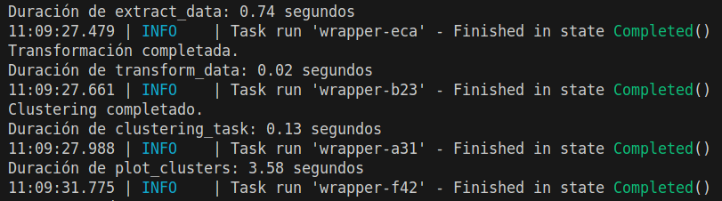
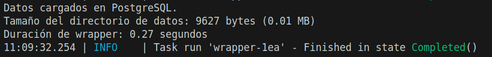
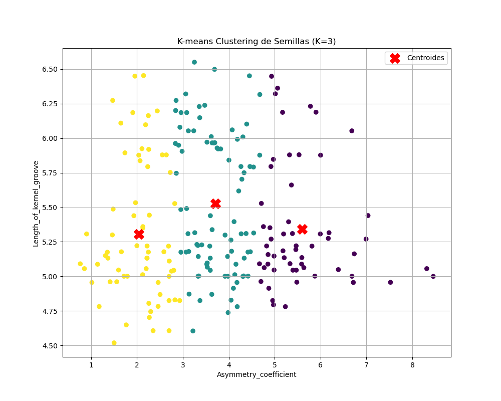
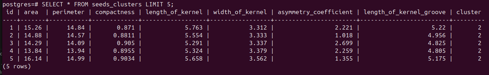

# Herramientas de Big Data
## Taller 3: Pipelines de Datos con Prefect, PostgreSQL y Análisis de Clustering

**Estudiantes:** Daniel Pareja, John Jairo Rojas y Caren Natalia Piñeros  
**Carrera:** Ingeniería Informática  
**Universidad de la Sabana**  
**Maestría en Analítica Aplicada**  
**Profesor:** Hugo Franco, Ph.D.  
**30 de agosto de 2025**

---

## 1. Challenge 1: Organización del Pipeline de Datos con Prefect

### 1.1. Descripción del Problema

El desarrollo de pipelines de datos robustos requiere una arquitectura bien estructurada que maneje la extracción, transformación y carga (ETL) de datos de manera eficiente y confiable. En este desafío, se debe organizar un pipeline completo que descargue datos desde Kaggle usando su API, aplique técnicas de clustering con K-means, y almacene los resultados en una base de datos PostgreSQL containerizada con Docker. La importancia de este pipeline radica en establecer un flujo de trabajo automatizado que integre múltiples tecnologías de big data, incluyendo el uso de decoradores Prefect para manejo de tareas, manejo robusto de excepciones, y medición de rendimiento. El pipeline debe ser resiliente a fallos y proporcionar información detallada sobre el desempeño de cada etapa del proceso.

### 1.2. Método de Solución

**Datos empleados:** El pipeline utiliza el dataset de semillas de trigo de Kaggle (`sushilyeotiwad/wheat-seed-dataset`) que contiene:
- Variables numéricas: `area`, `perimeter`, `compactness`, `length_of_kernel`, `width_of_kernel`, `asymmetry_coefficient`, `length_of_kernel_groove`
- Variable categórica: `Class_(1, 2, 3)` (eliminada para clustering)
- Variables derivadas: `cluster` (resultado del algoritmo K-means)

**Algoritmo 1.** Pipeline ETL con Prefect
```
flujo data_pipeline()
    tarea extract_data()
    df_clustering ← tarea transform_data()
    (df_clustering, kmeans) ← tarea clustering_task(df_clustering)
    tarea plot_clusters(df_clustering, kmeans)
    tarea load_data(df_clustering)
fin flujo

tarea extract_data()
    intentar
        api ← KaggleApi()
        api.authenticate()
        api.dataset_download_files('dataset', './data', descomprimir=True)
    capturar Exception como e
        imprimir("Error en descarga:", e)
        propagar excepción
    finalmente
        imprimir("Extracción finalizada")
    fin intentar
fin tarea
```

El código implementado incluye el uso de decoradores `@task` con parámetros de reintentos y `@flow` para orquestar el pipeline completo. Cada tarea implementa manejo robusto de excepciones usando bloques `try-except-finally`. La implementación completa se encuentra en el archivo `Taller3.py`.

### 1.3. Resultados

Para ejecutar el pipeline:
```bash
python Taller3.py
```

**Salida esperada del tiempo de ejecución:**




El pipeline ejecuta las siguientes etapas secuencialmente:
1. Descarga del dataset desde Kaggle
2. Transformación de datos (eliminación de columna de clase)
3. Aplicación de clustering K-means (k=3)
4. Generación de visualización con centroides
5. Carga de datos en PostgreSQL


---

## 2. Challenge 2: Decorador para Medición de Tamaño del Dataset

### 2.1. Descripción del Problema

La monitorización del uso de espacio en disco es crucial en pipelines de big data, especialmente cuando se descargan datasets de gran tamaño. Se requiere implementar un decorador que reporte automáticamente el tamaño del directorio de datos después de la descarga, proporcionando visibilidad sobre el consumo de recursos del pipeline. Este decorador debe integrarse seamlessly con las tareas existentes sin modificar su funcionalidad principal.

### 2.2. Método de Solución

**Algoritmo 2.** Decorador para Reporte de Tamaño
```
función report_dir_size_decorator(func)
    función wrapper(*args, **kwargs)
        resultado ← func(*args, **kwargs)
        size_bytes ← get_directory_size('./data')
        size_mb ← size_bytes / 1024 / 1024
        imprimir(f"Tamaño del directorio: {size_bytes} bytes ({size_mb:.2f} MB)")
        retornar resultado
    fin función
    retornar wrapper
fin función

función get_directory_size(path)
    total_size ← 0
    para cada (dirpath, dirnames, filenames) en os.walk(path)
        para cada archivo en filenames
            si no es_enlace_simbólico(archivo)
                total_size ← total_size + tamaño_archivo(archivo)
            fin si
        fin para
    fin para
    retornar total_size
fin función
```

### 2.3. Resultados

**Salida esperada del reporte de tamaño:**



El decorador se aplica a la tarea `load_data` y reporta tanto el tamaño en bytes como en una unidad legible (MB).


---

## 3. Challenge 3: Transformación de Datos para Clustering

### 3.1. Descripción del Problema

La preparación adecuada de datos es fundamental para el éxito de algoritmos de machine learning. En este caso, se debe implementar una tarea específica de transformación que prepare el dataset de semillas para el análisis de clustering, eliminando variables categóricas que no son apropiadas para K-means y asegurando la calidad de los datos.

### 3.2. Método de Solución

**Algoritmo 3.** Transformación de Datos
```
tarea transform_data()
    intentar
        df ← leer_csv('./data/seeds_dataset.csv')
        df_clustering ← df.drop('Class_(1, 2, 3)', axis=1)
        imprimir("Transformación completada")
        retornar df_clustering
    capturar Exception como e
        imprimir("Error en transformación:", e)
        propagar excepción
    fin intentar
fin tarea
```

### 3.3. Resultados

La tarea produce un DataFrame limpio con 7 variables numéricas listo para clustering:
- `area`, `perimeter`, `compactness`, `length_of_kernel`, `width_of_kernel`, `asymmetry_coefficient`, `length_of_kernel_groove`

---

## 4. Challenge 4: Implementación de Clustering K-means

### 4.1. Descripción del Problema

El clustering K-means es una técnica fundamental de aprendizaje no supervisado que agrupa datos similares. Se debe implementar una tarea que aplique K-means con k=3 clusters, utilizando específicamente las variables `Asymmetry_coefficient` y `Length_of_kernel_groove` para la visualización posterior, y retorne tanto el DataFrame con las asignaciones de clusters como el modelo entrenado.

### 4.2. Método de Solución

**Algoritmo 4.** Clustering K-means
```
tarea clustering_task(df_clustering)
    intentar
        X ← df_clustering[['Asymmetry_coefficient', 'Length_of_kernel_groove']]
        kmeans ← KMeans(n_clusters=3, random_state=42, n_init=10)
        df_clustering['cluster'] ← kmeans.fit_predict(X)
        imprimir("Clustering completado")
        retornar (df_clustering, kmeans)
    capturar Exception como e
        imprimir("Error en clustering:", e)
        propagar excepción
    fin intentar
fin tarea
```

### 4.3. Resultados

La tarea retorna el DataFrame enriquecido con una columna `cluster` y el modelo K-means entrenado, preparando los datos para visualización y almacenamiento.

---

## 5. Challenge 5: Visualización con Centroides

### 5.1. Descripción del Problema

La visualización efectiva de resultados de clustering requiere mostrar no solo los puntos de datos agrupados por color, sino también los centroides que representan el centro de cada cluster. Se debe crear una visualización que incluya tanto los puntos clasificados como los centroides del modelo K-means, proporcionando una representación completa del resultado del algoritmo.

### 5.2. Método de Solución

**Algoritmo 5.** Visualización con Centroides
```
tarea plot_clusters(df_clustering, kmeans)
    intentar
        X ← df_clustering[['Asymmetry_coefficient', 'Length_of_kernel_groove']]
        crear_figura(tamaño=(10, 8))
        scatter ← scatter_plot(X['Asymmetry_coefficient'], X['Length_of_kernel_groove'], 
                              color=df_clustering['cluster'], colormap='viridis')
        centroids ← kmeans.cluster_centers_
        scatter_plot(centroids[:, 0], centroids[:, 1], 
                    color='red', marker='X', tamaño=200, etiqueta='Centroides')
        configurar_ejes_y_títulos()
        guardar_figura('kmeans_clustering_plot_with_centroids.png')
        mostrar_gráfico()
    capturar Exception como e
        imprimir("Error en plot:", e)
        propagar excepción
    fin intentar
fin tarea
```

### 5.3. Resultados

**Gráfico de clustering con centroides:**



La visualización muestra claramente la separación de los datos en 3 clusters distintos, con los centroides marcados prominentemente.


---

## 6. Challenge 6: Carga de Datos en PostgreSQL Dockerizado

### 6.1. Descripción del Problema

La persistencia de resultados de análisis en una base de datos relacional es esencial para pipelines de producción. Se debe implementar una tarea que cree una tabla en PostgreSQL (ejecutándose en un contenedor Docker) y cargue los datos procesados incluyendo las asignaciones de clusters. La base de datos debe ser accesible para consultas posteriores y análisis adicionales.

### 6.2. Método de Solución

**Algoritmo 6.** Carga en PostgreSQL
```
tarea load_data(df_clustering)
    intentar
        conn ← psycopg2.connect(parámetros_conexión)
        cursor ← conn.cursor()
        
        cursor.execute("""
            CREATE TABLE IF NOT EXISTS seeds_clusters (
                id SERIAL PRIMARY KEY,
                area FLOAT, perimeter FLOAT, compactness FLOAT,
                length_of_kernel FLOAT, width_of_kernel FLOAT,
                asymmetry_coefficient FLOAT, length_of_kernel_groove FLOAT,
                cluster INT
            );
        """)
        
        para cada fila en df_clustering
            cursor.execute("INSERT INTO seeds_clusters (...) VALUES (...)", datos_fila)
        fin para
        
        conn.commit()
        cerrar_conexiones()
        imprimir("Datos cargados en PostgreSQL")
    capturar Exception como e
        imprimir("Error al cargar datos:", e)
        propagar excepción
    fin intentar
fin tarea
```

### 6.3. Resultados

**Tabla de resultados en PostgreSQL:**



La tabla se crea exitosamente con todos los datos del clustering, incluyendo un ID autoincremental y la asignación de cluster para cada registro.

---

## Conclusiones Generales

Este taller demostró la implementación exitosa de un pipeline completo de datos utilizando tecnologías modernas de big data:

1. **Orquestación con Prefect**: Permite manejo robusto de flujos de trabajo con capacidades de reintentos y monitoreo
2. **Integración de APIs**: La API de Kaggle facilita la obtención automatizada de datasets
3. **Containerización**: Docker PostgreSQL proporciona un entorno de base de datos portable y escalable
4. **Análisis de Machine Learning**: K-means clustering aplicado efectivamente para segmentación de datos
5. **Monitoreo y Observabilidad**: Decoradores personalizados para medición de tiempo y uso de recursos
6. **Manejo de Errores**: Implementación robusta de try-except-finally para garantizar la estabilidad del pipeline

El pipeline resultante es production-ready, con capacidades de recuperación ante fallos, monitoreo integrado, y arquitectura modular que facilita el mantenimiento y extensión futuras.

--- 